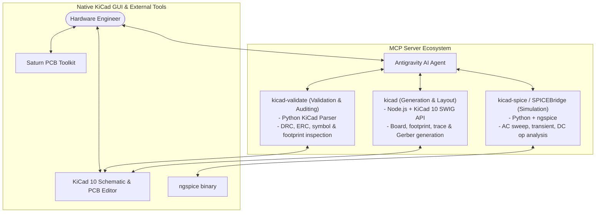

# PCB Automation Pipeline: Engineer's Field Guide

## 1. Executive Summary & Core Philosophy

This automation pipeline accelerates PCB design by offloading repetitive mechanical setup, mathematical checks, programmatic routing primitives, rule checking, and simulation to an AI agent paired with three specialized Model Context Protocol (MCP) servers.

The core philosophy is **Human-in-the-Loop Engineering**:
- The **AI Agent & MCP Servers** handle rapid execution, netlist/schematic scaffolding, SPICE simulations, geometric calculations, repetitive placement, DRC/ERC audits, and manufacturing exports.
- The **Hardware Engineer** maintains architectural control, critical signal routing intuition, component sourcing decisions, thermal/mechanical constraints, and final review before fabrication.

---

## 2. Role of SPICE in PCB Design

### Why Use SPICE?
SPICE (Simulation Program with Integrated Circuit Emphasis) allows you to verify circuit physics **mathematically and electrically before placing physical copper on a board**. 

Catching a fundamental circuit flaw on a fabricated PCB takes 1–3 weeks for a redesign, re-fab, and assembly cycle ($50–$500+ per spin). In contrast, catching it in SPICE takes seconds.

### Where SPICE is Essential:
1. **Filters (Active & Passive):** Low-pass, high-pass, band-pass, and notch filters (e.g., Sallen-Key, MFB). Verifying exact -3 dB cutoff frequencies, roll-off rates, passband ripple, and phase distortion.
2. **Amplifier & Gain Stages:** Op-amp feedback loops, transistor biasing, differential gain, common-mode rejection (CMRR), and gain-bandwidth limits.
3. **Power Supply Regulation & Feedback:** Voltage dividers, DC operating point bias, transient response under load steps, and ripple rejection.
4. **Oscillators & Resonators:** Startup conditions, loop gain (> 1 at phase = 0°), and oscillation stability.
5. **Protection & Clamping Circuits:** ESD suppression, Zener diodes, TVS diode response times, and inrush current limiting.

---

## 3. Architecture of the 3-MCP Server Pipeline

### Server Roles:
1. **`kicad` (Generation & Layout Server):**
   - **Engine:** Node.js bridging KiCad's official Python/SWIG interface (`_pcbnew`).
   - **Tasks:** Creates projects, sets board boundaries, places components by coordinates, creates nets, routes traces, creates copper zones, exports Gerbers/Drill/BOM/POS files.
2. **`kicad-validate` (Validation Server):**
   - **Engine:** Python-based parser (`seeed-kicad-mcp-server`).
   - **Tasks:** Structural PCB statistics, symbol queries, pin-mux validation, Electrical Rules Check (ERC), and netlist validation.
3. **`kicad-spice` (SPICEBridge Simulation Server):**
   - **Engine:** Python wrapping native `ngspice`.
   - **Tasks:** Runs AC frequency response, DC operating points, transient load steps, parameter sweeps, and extracts -3 dB cutoff, gain, and phase margins.

---

## 4. Division of Labor: Engineer vs. LLM/Servers

| Task / Domain | LLM + Automation Pipeline | Hardware Engineer |
|---|---|---|
| **Circuit Topology & Architecture** | Suggests standard application circuits and templates | **Decides final topology, IC selection, and operating voltage/current targets** |
| **SPICE Simulation** | **Runs sweeps, calculates bandwidth, gain, and stability margins in seconds** | Verifies simulation matches real-world component tolerances (e.g. DC bias derating) |
| **Schematic Scaffolding** | **Adds components, labels, nets, and power flags rapidly** | Verifies pinouts, custom symbols, and logic flow |
| **Component Placement** | **Calculates exact grid coordinates, aligns arrays, and checks courtyards** | **Groups functional blocks (Analog vs Digital isolation, thermal path, connector accessibility)** |
| **Critical Routing (RF, Diff Pairs, High Power)** | Suggests trace width/spacing based on impedance models | **Manually routes or inspects critical signal return paths, high dI/dt loops, and sensitive analog nets** |
| **Bulk Signal / Non-Critical Routing** | **Automates point-to-point traces, ground stitching vias, and copper pours** | Inspects plane cuts and return current paths under high-speed traces |
| **Design Rule Check (DRC / ERC)** | **Runs audits programmatically and lists exact coordinates of errors** | Fixes mechanical overlaps, complex 3D clearance issues |
| **Manufacturing Package** | **Exports Gerbers, drill files, BOM, and POS files automatically** | Reviews Gerber preview and submits to fabricator (JLCPCB, PCBWay, etc.) |

---

## 5. Contingency Plan: What If MCP Servers Corrupt or Fail?

Because all three MCP servers run **locally on your machine** and interact with standard file formats (`.kicad_sch`, `.kicad_pcb`, `.cir`), your workflow is resilient.

### Threat Scenarios & Immediate Solutions:

#### Scenario A: A GitHub repo updates with a breaking bug or gets deleted
- **Protection:** All three repositories are cloned locally into your workspace (`g:\PCB_automation\KiCAD-MCP-Server`, `g:\PCB_automation\seeed-kicad-mcp-server`, `g:\PCB_automation\SPICEBridge`). Upstream GitHub changes **do not touch your machine unless you run `git pull`**.
- **Backup Rule:** Keep a `.zip` backup of `g:\PCB_automation\` containing the working virtual environments and node modules.

#### Scenario B: One MCP server crashes or fails to start
1. **If `kicad-spice` fails:**
   - Run SPICE simulations directly inside KiCad Schematic Editor (`Inspect -> Simulator`) using KiCad’s built-in ngspice engine, or run standalone `ngspice` from `C:\Users\hp400\Spice64\bin\ngspice_con.exe`.
2. **If `kicad` or `kicad-validate` fails:**
   - Open the project directly in **KiCad 10 GUI** (`Converter.kicad_pro`).
   - The LLM can still generate `.kicad_sch` / `.kicad_pcb` Python scripts that you execute directly via KiCad's built-in Scripting Console (`Tools -> Scripting Console` in PCB Editor).
3. **If `mcp_config.json` is corrupted:**
   - Restore the configuration from `c:\Users\hp400\.gemini\config\mcp_config.json.bak` or re-point the paths to the local node/python binaries.

#### Standalone Fallback Matrix:

| Broken Stage | Standalone Alternative without MCP |
|---|---|
| Simulation | KiCad Built-in Simulator (`Inspect -> Simulator`) or standalone LTspice / ngspice |
| Schematic Entry | KiCad Schematic Editor (`kicad.exe`) |
| Trace Impedance | Saturn PCB Toolkit (`g:\PCB_automation\tools\SaturnPCBToolkit\`) |
| Auto-routing | Standalone Freerouting jar (`java -jar freerouting.jar -de project.dsn`) |
| DRC / ERC | KiCad GUI DRC dialog (`Inspect -> Design Rules Checker`) |
| Gerbers | KiCad `File -> Fabrication Outputs -> Gerbers / Drill Files` |

---
