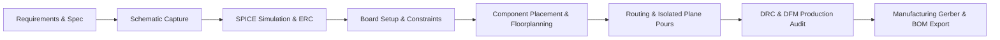

# PCB Automation & Design Pipeline

An autonomous, end-to-end PCB design, verification, and manufacturing pipeline powered by **KiCad**, **SPICE**, and **AI-driven Automation Agents**.

---

## 🚀 Overview & Automation Architecture

This repository contains automated workflows, design tools, and complete hardware projects demonstrating AI-assisted schematic creation, SPICE verification, electrical rules check (ERC), automated component placement, routing, clearance isolation, and design rules check (DRC).

---

## 📂 Projects in this Repository

### 1. `projects/ACtoDCtoMicrocontroller`
* **Description:** An integrated power conversion and microcontroller subsystem converting mains AC to regulated DC logic levels to power an embedded MCU.
* **Key Features:** Full-wave bridge rectification, linear regulation stage, MCU decoupling, and GPIO breakout.
* **Artifacts:** Complete `.kicad_sch`, `.kicad_pcb`, interactive SVGs, BOM, and CPL files.

### 2. `projects/AC_DC_converter_with_regulated_dc`
* **Description:** A **$60\text{ mm} \times 50\text{ mm}$** AC-to-DC Adjustable Regulated Power Supply using a Full-Wave Bridge Rectifier and LM317.
* **Key Features:**
  * **Primary High-Voltage AC Domain ($X \le 120\text{ mm}$):** 2-pin screw terminal (`J1`), MOV surge suppressor (`RV_MOV1`), 5x20mm fuse (`F1`), and 1N4007 bridge rectifier (`D1–D4`).
  * **Secondary Low-Voltage DC Domain ($X \ge 122\text{ mm}$):** $1000\mu\text{F}$ bulk filter (`C1`), LM317 regulator (`U1`), 5k$\Omega$ precision trimpot (`RV1`), output decoupling (`C4`, `C5`), and green LED indicator (`D7`).
  * **Safety & Isolation:** $>3.0\text{ mm}$ physical creepage/clearance barrier between Primary AC and Secondary DC.
  * **Isolated Ground Pours:** Top and Bottom GND copper pours restricted to the DC secondary domain.
  * **Verification Status:** **0 ERC Errors, 0 DRC Errors, 0 Courtyard Overlaps, 0 Boundary Violations**.

---

## 🛠️ Automated Tools & Pipeline Frameworks

* **`PCB_AUTOMATION_PIPELINE_GUIDE.md`**: Complete architectural reference guide for automating KiCad schematic capture, layout, SPICE simulation, and Gerber generation.
* **`pcb-workflow.md`**: Step-by-step workflow for executing design steps from netlist generation to DFM checks.
* **`KiCAD-MCP-Server`**: Model Context Protocol integration enabling autonomous LLM interaction with KiCad's layout engine.
* **`SPICEBridge`**: Automated SPICE netlist extraction and ngspice simulation harness.
* **`Konnect`**: Automated net connectivity and routing optimization toolset.

---

## 📄 License
MIT License. Open source hardware and automation scripts.
