# PCB Automation & Design Pipeline

An autonomous, end-to-end PCB design, verification, and manufacturing pipeline powered by **KiCad 10**, **SPICE**, **OpenEMS 3D FDTD**, **ParaView**, and **AI-driven Automation Agents**.

⭐ **If you find this repository useful for your PCB workflows or research, please consider giving it a star!**

  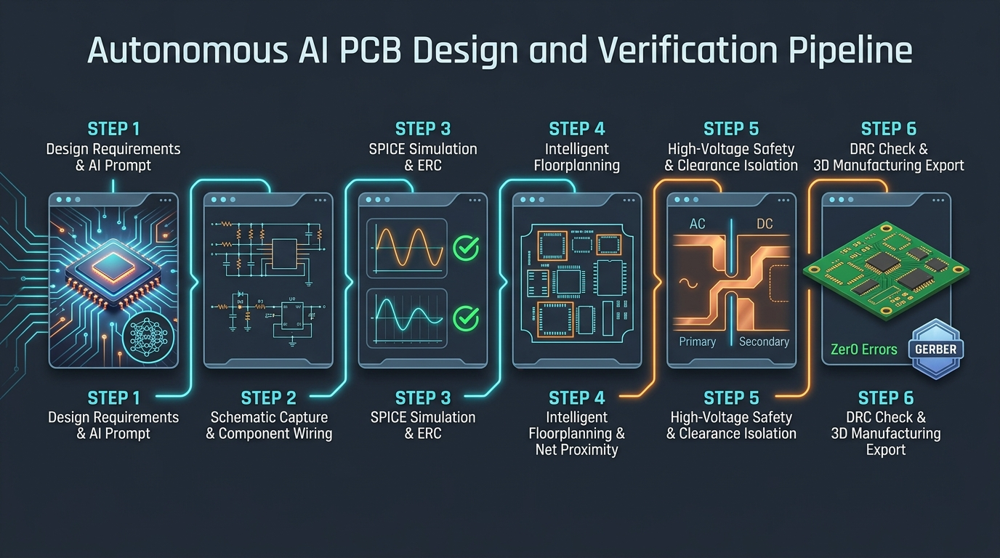

---

## 🚀 Overview & Automation Architecture

This repository contains automated workflows, design tools, and complete hardware projects demonstrating AI-assisted schematic creation, SPICE verification, electrical rules check (ERC), automated component placement, routing, clearance isolation, and design rules check (DRC).

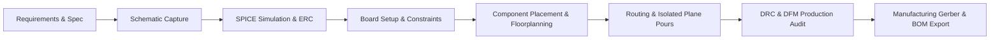
```mermaid
graph LR
    A["Requirements & Spec"] --> B["Schematic Capture"]
    B --> C["SPICE Simulation & ERC"]
    C --> D["Board Setup & Constraints"]
    D --> E["Component Placement & Floorplanning"]
    E --> F["Routing & Isolated Plane Pours"]
    F --> G["DRC & DFM Production Audit"]
    G --> H["Manufacturing Gerber & BOM Export"]
```

---

## 📂 Projects in this Repository

### 1. `projects/ACtoDCtoMicrocontroller`
* **Description:** An integrated compact IoT board converting mains AC to regulated 5V & 3.3V DC to power an ESP32/Microcontroller with USB programming, switches, and antenna keepout.
* **Key Features:**
  * **Mains AC Input Stage:** Screw terminal (`J1`), NTC inrush limiter (`RT1`), X-Capacitor (`C1`), and HLK-5M05 isolated AC-DC module.
  * **Microcontroller & Logic Domain:** 3.3V LDO regulator, ESP32 module, reset & boot switches, Micro-USB interface, and dedicated RF Antenna Keep-Out Zone.
  * **Physical Isolation:** Strict primary-to-secondary dielectric isolation barrier.
  * **Artifacts:** Complete `.kicad_sch`, `.kicad_pcb`, interactive SVGs, manufacturing BOM, and CPL files.

#### Visual Showcase & 3D Previews

  <b>Schematic Diagram (Annotated Subsystems)</b> 
  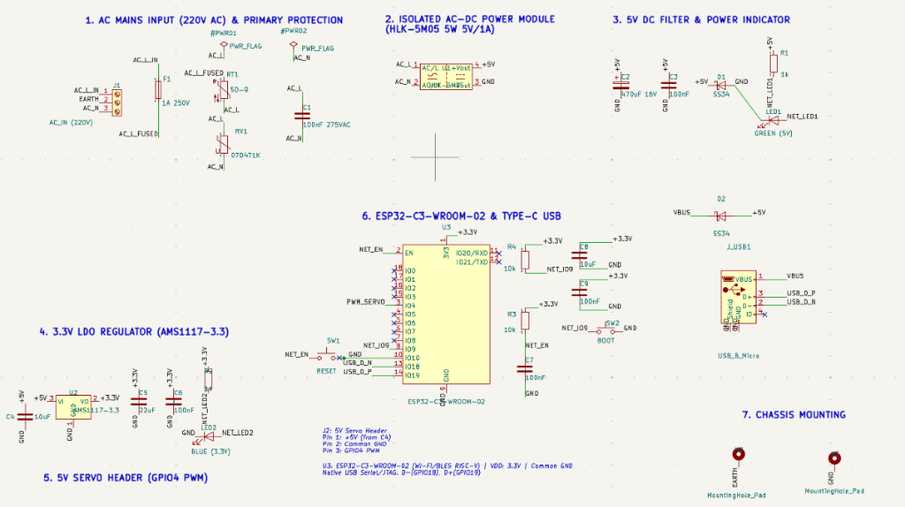

| Top Layer Layout (HV Isolation & 5V Fill) | Bottom Layer Layout (3.3V & Signal Routing) |
| :---: | :---: |
| 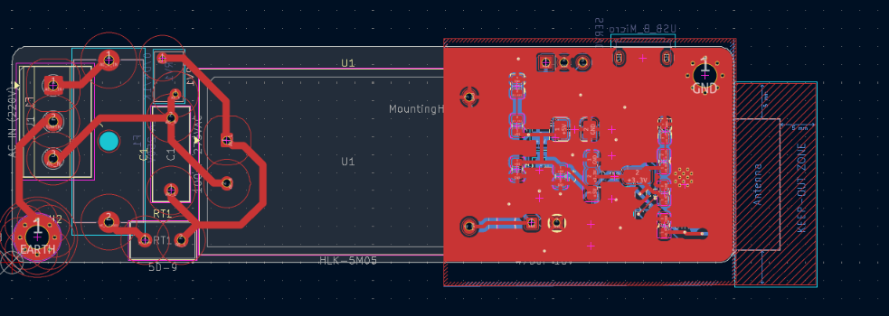 | 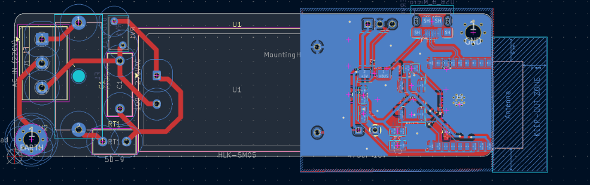 |

| Top 3D Assembly (HLK Module & AC Protection) | Bottom 3D Assembly (MCU, Buttons, USB) |
| :---: | :---: |
| 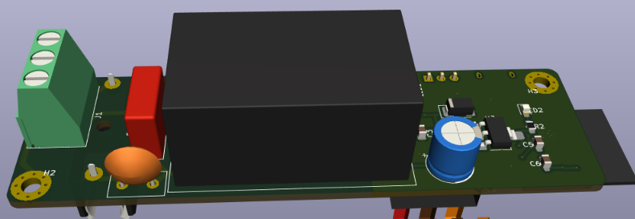 | 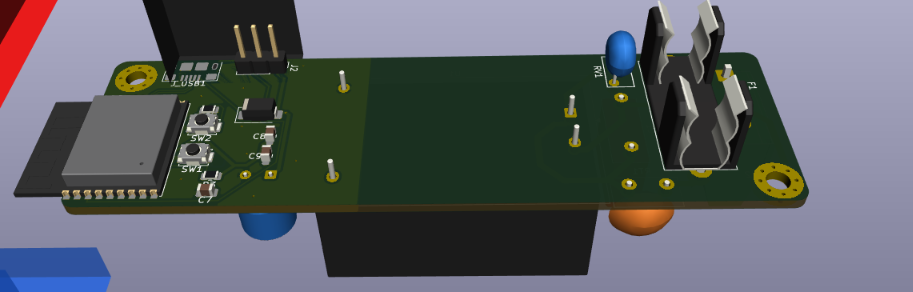 |

### 2. `projects/AC_DC_converter_with_regulated_dc`
* **Description:** A **$60\text{ mm} \times 50\text{ mm}$** AC-to-DC Adjustable Regulated Power Supply using a Full-Wave Bridge Rectifier and LM317.
* **Key Features:**
  * **Primary High-Voltage AC Domain ($X \le 120\text{ mm}$):** 2-pin screw terminal (`J1`), MOV surge suppressor (`RV_MOV1`), 5x20mm fuse (`F1`), and 1N4007 bridge rectifier (`D1–D4`).
  * **Secondary Low-Voltage DC Domain ($X \ge 122\text{ mm}$):** $1000\mu\text{F}$ bulk filter (`C1`), LM317 regulator (`U1`), 5k$\Omega$ precision trimpot (`RV1`), output decoupling (`C4`, `C5`), and green LED indicator (`D7`).
  * **Safety & Isolation:** $>3.0\text{ mm}$ physical creepage/clearance barrier between Primary AC and Secondary DC.
  * **Isolated Ground Pours:** Top and Bottom GND copper pours restricted to the DC secondary domain.
  * **Verification Status:** **0 ERC Errors, 0 DRC Errors, 0 Courtyard Overlaps, 0 Boundary Violations**.

#### Visual Showcase & Design Views

| Schematic (Annotated Sections) | 2D PCB Layout (HV/LV Split & GND Pour) |
| :---: | :---: |
| 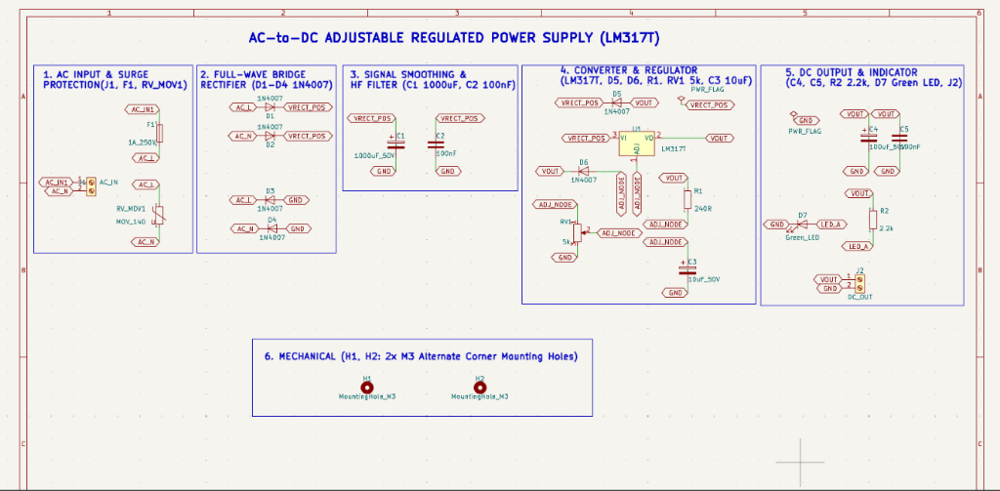 | 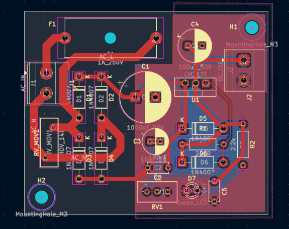 |

  <b>3D Board Assembly Render</b> 
  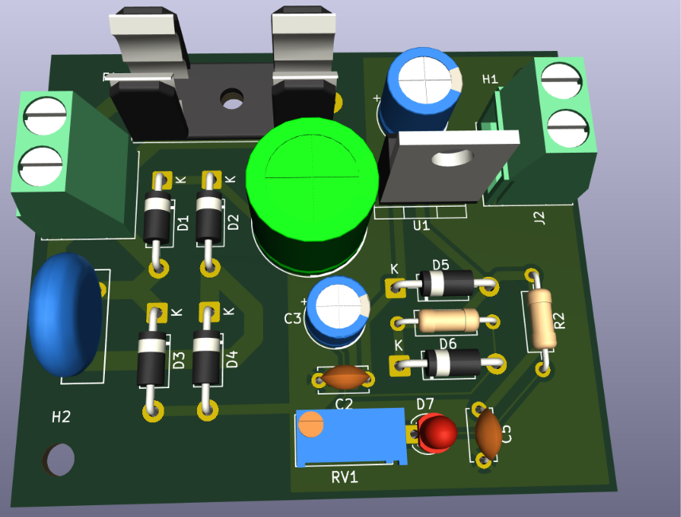

### 3. `projects/Binary_Counter_8Bit`
* **Description:** An autonomous 8-Bit Binary Counter circuit ($0 - 255$) featuring an NE555 timer clock generator, 74HC590 8-bit binary counter, 8-LED binary readout bar, speed trimpot, and USB power.
* **Key Features:**
  * **USB-B Micro 5V Input:** Over-current fuse protection (`F1`), Schottky reverse diode (`D1`), and SMAJ5.0A TVS protection (`D2`).
  * **NE555 Precision Clock Generator:** Astable timer circuit with adjustable speed potentiometer (`RV1`) and clock pulse LED indicator (`D_CLK`).
  * **74HC590 8-Bit Binary Counter & Register:** Direct driving of an 8-LED binary output array (`D3 - D10`) with dedicated current limiting resistors (`R3 - R10`).
  * **Active Reset Circuit:** Tactile pushbutton (`SW_RST`) with pull-up resistor (`R_PULL_RST`).

#### Visual Showcase & 3D Previews

  <b>Schematic Diagram (Timer, Counter & Output Display)</b> 
  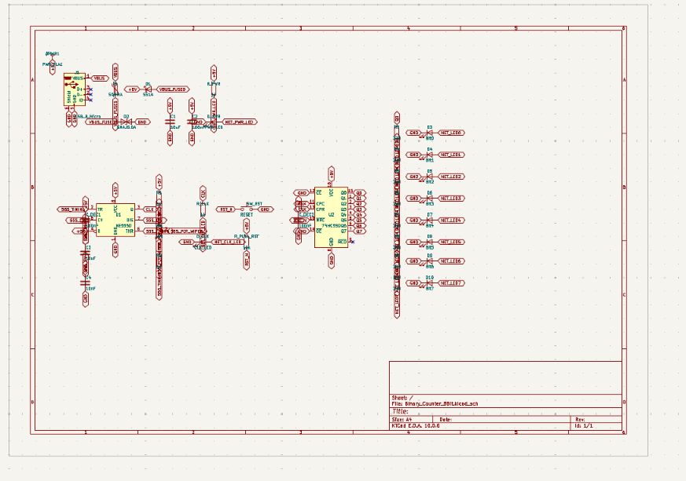

| 2D PCB Layout (Floorplan & Traces) | 2D PCB Layout (Copper & Pour View) |
| :---: | :---: |
| 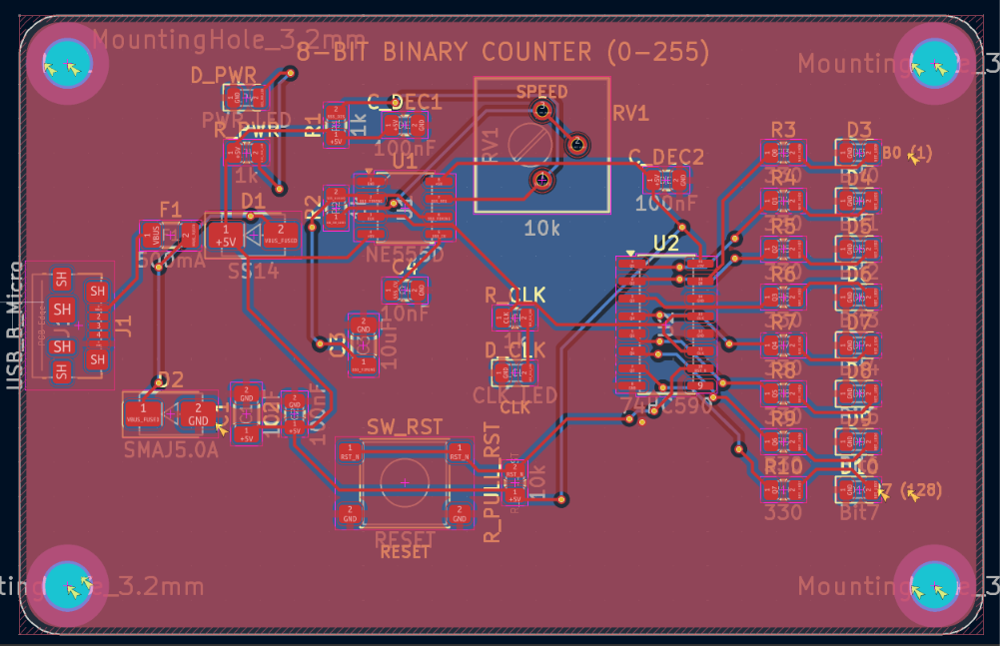 | 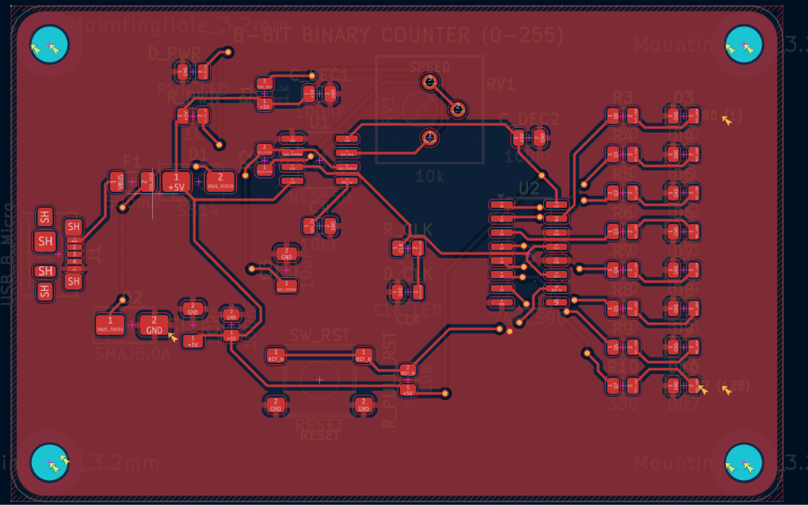 |

  <b>3D Board Assembly Render</b> 
  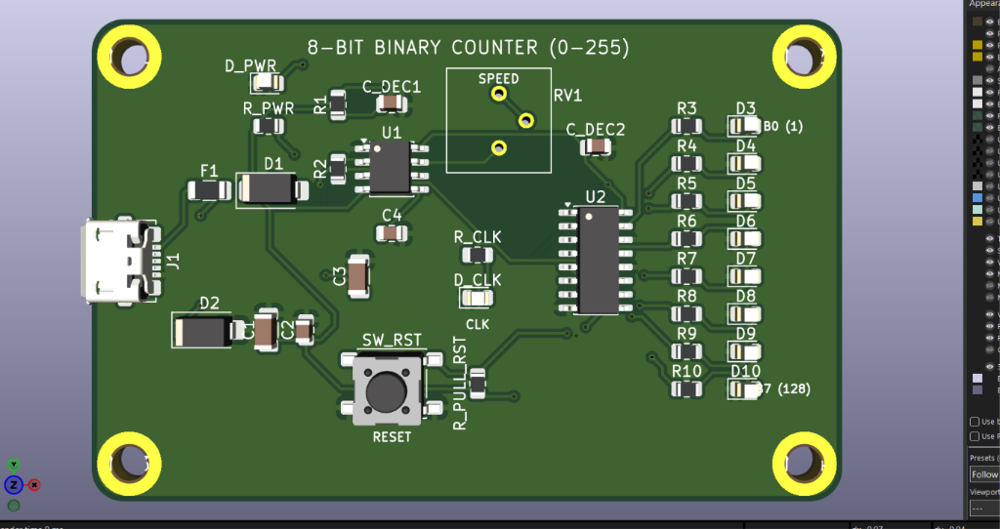

### 4. `projects/RF_Detector`
* **Description:** A 4-Layer High-Frequency RF Logarithmic Power Detector board ($500\text{ MHz} - 1.0\text{ GHz}$) featuring an SMA edge input, Analog Devices AD8313 logarithmic detector, ADS7042 12-bit SPI ADC, and dedicated analog/digital ground splits.
* **Key Features:**
  * **RF Signal Path:** $50\ \Omega$ microstrip line ($w = 0.38\text{ mm}$) on $0.2\text{ mm}$ FR4 core directly referencing a solid Layer 2 ground plane.
  * **Full-Wave 3D FDTD EM Simulation (OpenEMS):** $S_{11} = -15.96\text{ dB}$ resonance at $750\text{ MHz}$, $-29.66\text{ dB}$ max crosstalk isolation into the adjacent digital SPI bus.
  * **3D Field Visualization (ParaView):** Time-domain wave propagation ($\vec{E}(t)$) and frequency-domain harmonic vector distributions exported as VTK field dumps.

### 5. `projects/RF_LVDS/LVDS` (High-Speed $\ge 400\text{ Mbps}$ Differential Link)
* **Description:** A 4-Layer High-Speed LVDS Evaluation Board featuring **TI SN65LVDS1D (Driver)** and **SN65LVDT2D (Receiver with internal 110 Ω termination)**.
* **Key Features:**
  * **Controlled Impedance Interconnects:** $100\ \Omega$ edge-coupled microstrip ($W = 0.15\text{ mm}, S = 0.15\text{ mm}$) over $0.1\text{ mm}$ prepreg, with $50\ \Omega$ single-ended RF SMA launches.
  * **Ground Integrity & Via Stitching:** 5.0 mm uniform ground stitching grid across the board interior with a perimeter via fence for low-inductance return loops.
  * **3D Full-Wave EM Co-Simulation:** Full FDTD wave propagation ($E$-field, $H$-field, and $J$-current density) animated in ParaView.
  * **Manufacturing:** Complete Gerber RS-274X, NC Drill, and 3D STEP models with 0 DRC violations and 0 unconnected pads.

---

## 🛠️ Automated Tools & Pipeline Frameworks

* **`PCB_AUTOMATION_PIPELINE_GUIDE.md`**: Complete architectural reference guide for automating KiCad schematic capture, layout, SPICE simulation, OpenEMS 3D EM analysis, and Gerber generation.
* **`pcb-workflow.md`**: Step-by-step workflow with mandatory pre-layout SPICE and post-layout OpenEMS verification gates.
* **`KiCAD-MCP-Server`**: Model Context Protocol integration enabling autonomous LLM interaction with KiCad's layout engine.
* **`SPICEBridge` (`kicad-spice`)**: Automated SPICE netlist extraction and ngspice simulation harness.
* **`openems-sim` (`antenna-cad`)**: 3D Full-Wave FDTD Electromagnetic field solver running inside a dedicated Docker container (`antenna-cad-openems`).
* **`ParaView 6.1.1`**: 3D scientific field viewer for near-field coupling, surface currents, and wave propagation animation.
* **`Saturn PCB Toolkit`**: Deterministic analytical transmission line, via capacitance, and thermal modeling toolkit.
* **`Konnect`**: Automated net connectivity and routing optimization toolset.

---

## 🤝 Commercial Inquiries & Custom PCB Design

Need custom hardware design, high-speed differential layout, RF / antenna 3D EM simulation, or pre-fabrication DRC/SPICE auditing?
- Open an issue or start a [GitHub Discussion](https://github.com/himanshu40304/PCB_automation/discussions).
- Turnaround time for SPICE-verified, DRC-clean design packages is typically **under 24–48 hours**.

---

## 📄 License

This project is licensed under the **MIT License** - see the [LICENSE](LICENSE) file for details. Free for both open-source and commercial applications.
