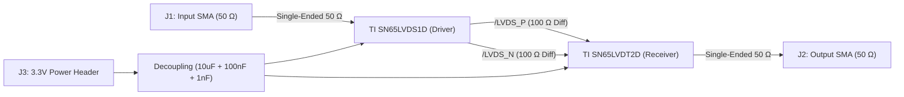

# High-Speed Point-to-Point LVDS Test & Evaluation PCB

A high-speed 4-layer Low-Voltage Differential Signaling (LVDS) evaluation board featuring the **Texas Instruments SN65LVDS1D (Driver)** and **SN65LVDT2D (Receiver with integrated 110 Ω termination)** capable of $\ge 400\text{ Mbps}$ data transmission with co-planar controlled-impedance interconnects, full-coverage ground stitching, 4-side ENIG gold edge plating, and 3D full-wave OpenEMS/ParaView simulation.

---

## 📐 Board Specifications

| Parameter | Specification | Notes |
| :--- | :--- | :--- |
| **Dimensions** | 70.0 mm × 50.0 mm | Standard compact evaluation form factor |
| **Layer Stackup** | 4-Layer Controlled Impedance (JEDEC standard) | $1.6\text{ mm}$ overall thickness, FR4 ($\varepsilon_r = 4.5$) |
| **Layer 1 (Top)** | High-Speed Microstrip + RF SMA Launch | $100\ \Omega$ diff pair ($W=0.15\text{ mm}, S=0.15\text{ mm}$), $50\ \Omega$ single-ended ($W=0.18\text{ mm}$) |
| **Layer 2 (Inner 1)** | Solid Unbroken GND Ground Plane | Continuous reference plane directly under high-speed traces |
| **Layer 3 (Inner 2)** | 3.3V Power Plane (PDN) | Low-impedance power distribution with 100 nF + 1 nF decoupling |
| **Layer 4 (Bottom)** | Solid GND Shield Plane | Ground return with perimeter via fence |
| **Edge Finish** | 4-Side ENIG Gold Edge Plating | Continuous perimeter Faraday cage + EMI radiation suppression |
| **Via Stitching** | 5.0 mm Interior Grid + 3.5 mm Perimeter Fence | 0.6 mm pad diameter, 0.3 mm drill hole |

---

## ⚡ Circuit Architecture

---

## 🔬 Simulation & Verification Pipeline

1. **SPICE PDN Decoupling Analysis**:
   - Simulated impedance notches across $10\text{ kHz} - 1\text{ GHz}$, verifying low PDN impedance at $25\text{ MHz}$ ($100\text{ nF}$) and $250\text{ MHz}$ ($1\text{ nF}$).
2. **High-Speed Signal Integrity**:
   - $350\text{ mV}$ differential output swing, $1.25\text{ V}$ common mode, $< 5\%$ reflection into the internal $110\ \Omega$ termination.
3. **OpenEMS 3D FDTD Full-Wave Simulation**:
   - Full-wave Maxwell equations solved in 3D time domain.
   - Electric field ($E_t$), Magnetic field ($H_t$), and Current Density ($J_t$) exported to `.vtr` format.
4. **ParaView 3D Animated Wave Visualization**:
   - Animated electromagnetic pulse propagation and 3D streamline tube vectors surfing along the transmission lines.

---

## 📁 Manufacturing Artifacts
- Gerber RS-274X: `gerber/`
- Excellon NC Drill: `gerber/LVDS.drl`
- 3D STEP Model: `LVDS.step`
- Design Rules: Passed with 0 unconnected items.
