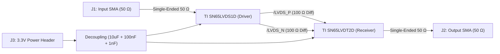
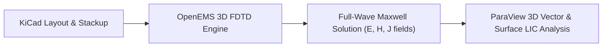

# High-Speed Point-to-Point LVDS Test & Evaluation PCB

A high-speed 4-layer Low-Voltage Differential Signaling (LVDS) evaluation board featuring the **Texas Instruments SN65LVDS1D (Driver)** and **SN65LVDT2D (Receiver with integrated 110 Ω termination)** capable of $\ge 400\text{ Mbps}$ data transmission with co-planar controlled-impedance interconnects, full-coverage ground stitching, and 3D full-wave OpenEMS/ParaView simulation.

---

## 📐 Board Specifications

| Parameter | Specification | Notes |
| :--- | :--- | :--- |
| **Dimensions** | 70.0 mm × 50.0 mm | Standard compact evaluation form factor |
| **Layer Stackup** | 4-Layer Controlled Impedance (JEDEC standard) | $1.6\text{ mm}$ overall thickness, FR4 ($\varepsilon_r = 4.5$) |
| **Layer 1 (Top)** | High-Speed Microstrip + RF SMA Launch | $100\ \Omega$ diff pair ($W=0.15\text{ mm}, S=0.15\text{ mm}$), $50\ \Omega$ single-ended ($W=0.18\text{ mm}$) |
| **Layer 2 (Inner 1)** | Solid Unbroken GND Ground Plane | Continuous reference plane directly under high-speed traces |
| **Layer 3 (Inner 2)** | 3.3V Power Plane (PDN) | Low-impedance power distribution with 100 nF + 1 nF decoupling |
| **Layer 4 (Bottom)** | Solid GND Shield Plane | Ground return reference plane |
| **Via Stitching** | 5.0 mm Interior Grid + 3.5 mm Perimeter Fence | 0.6 mm pad diameter, 0.3 mm drill hole for low-inductance return paths |

---

## ⚡ Circuit Architecture

---

## 🔬 3D Full-Wave Electromagnetic & Field Simulation Pipeline

High-speed PCB signals at $> 400\text{ Mbps}$ are **guided electromagnetic waves**, where energy travels primarily through the dielectric substrate between the signal trace and reference ground plane. 

To validate transmission line dynamics before physical fabrication, this board was simulated using **OpenEMS (Finite-Difference Time-Domain full-wave Maxwell solver)** and visualized in **ParaView 6.1**:

### Key Simulation Models:
1. **End-to-End Transmission Line Domain (70 mm × 50 mm)**:
   - Full board substrate modeled in FR4 ($\varepsilon_r = 4.5, \tan\delta = 0.02$) over a $0.10\text{ mm}$ prepreg height to Layer 2 solid ground plane.
   - Left SMA input launch ($50\ \Omega$) $\rightarrow$ Driver `U2` $\rightarrow$ $100\ \Omega$ Differential Pair ($W=0.15\text{ mm}, S=0.15\text{ mm}$) $\rightarrow$ Receiver `U3` ($110\ \Omega$ termination) $\rightarrow$ Right SMA output launch ($50\ \Omega$).
2. **Surface LIC (Line Integral Convolution) Vector Field Analysis**:
   - Computes continuous streamflow streaklines directly from the electric vector field $\vec{E}(t)$, revealing:
     - **Radial Launch Pattern**: Coaxial TEM-to-microstrip transition at the SMA connector launch.
     - **Differential Coupling**: Strong transverse field confinement tightly bounded between the positive and negative differential microstrips.
     - **Zero Stray Coupling**: Near-zero field leakage into surrounding ground fill.
3. **Ground Plane Integrity & Perimeter Via Shielding**:
   - High-density ground via stitching matrix (5.0 mm grid) connecting Top, Inner 1, and Bottom ground planes, backed by a perimeter via fence to suppress edge radiation and maintain low-inductance ground return loops.

---

## 🌟 Engineering Benefits of 3D EM Simulation for High-Speed PCBs

| Engineering Challenge | How 3D EM Simulation Resolves It |
| :--- | :--- |
| **Impedance Discontinuities** | Visualizes localized wave reflections and capacitance bumps at SMA launches and chip pad transitions before tape-out. |
| **Differential Symmetry & Skew** | Verifies equal phase velocity and tight coupling between `/LVDS_P` and `/LVDS_N`, preventing common-mode noise conversion. |
| **High-Frequency Return Currents** | Proves that the high-frequency return current stays tightly confined on Layer 2 GND directly beneath the trace path, minimizing loop inductance. |
| **EMI & Edge Radiation Suppression** | Validates that the solid ground reference planes and perimeter stitching fence prevent fringing electromagnetic waves from radiating off the PCB edges. |
| **Pre-Fabrication Signoff** | Eliminates costly PCB prototype respins by diagnosing signal integrity (SI) and electromagnetic compatibility (EMC) bottlenecks in software. |

---

## 📁 Manufacturing Artifacts
- **Gerber RS-274X Package:** `gerber/`
- **Excellon NC Drill:** `gerber/LVDS.drl`
- **3D Mechanical STEP Model:** `LVDS.step`
- **DRC & ERC Status:** **Passed (0 DRC Violations, 0 Unconnected Items)**.

